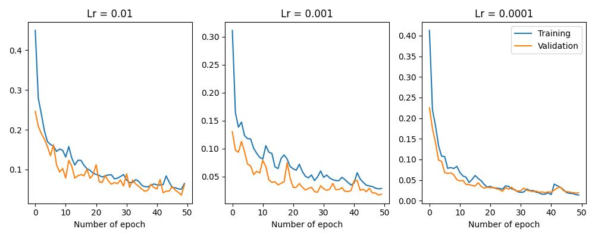
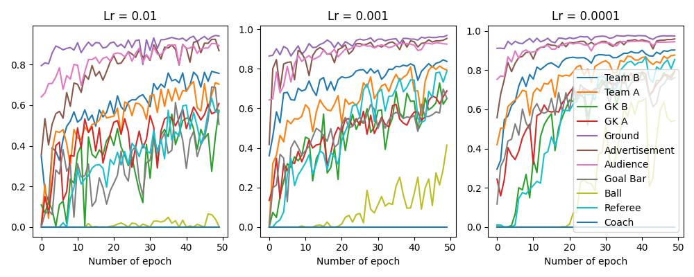
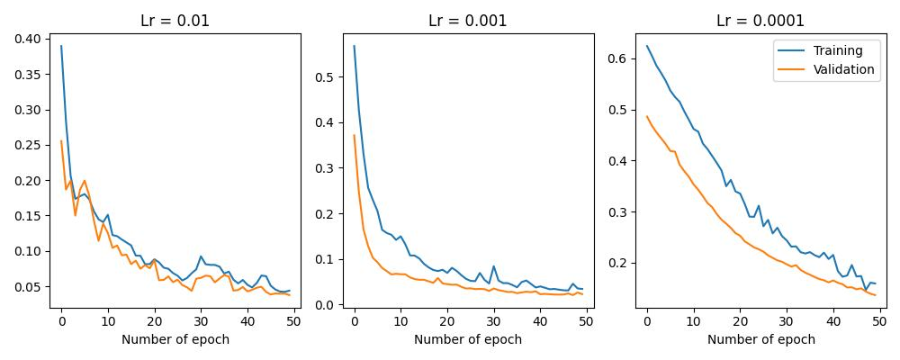
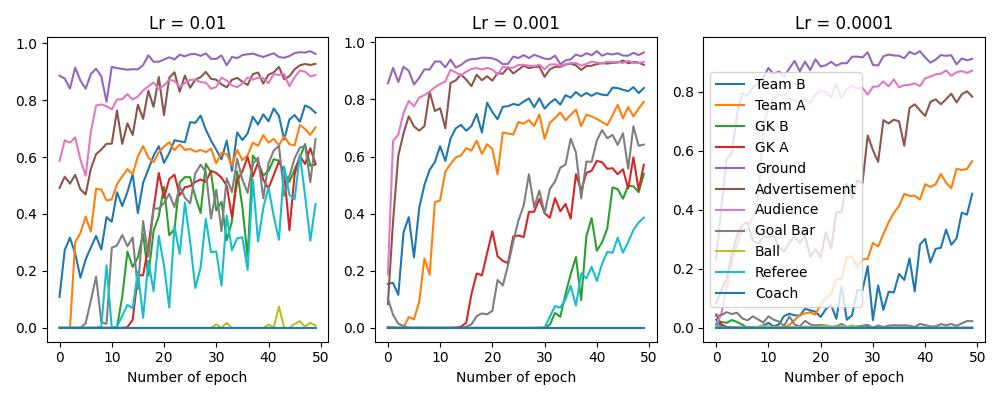

# Raw Implementation for UNet using C/C++

This project implements UNet and EfficientNet-UNet (Eff-UNet) models for image segmentation using LibTorch in C++. The project is designed to be built with CMake and requires OpenCV.

## Illustration

Here are some illustrations of the model's performance. For a more detailed analysis of the results, please refer to the `report.pdf` file.

### Learning Curves

Here are the learning curves for the UNet and Eff-UNet models, showing the training and validation error, as well as the mean Intersection over Union (mIoU) for each class.

**UNet**

| Error                               | IoU                                 |
| ----------------------------------- | ----------------------------------- |
|  |  |

**Eff-UNet**

| Error                                 | IoU                                   |
| ------------------------------------- | ------------------------------------- |
|  |  |

### Sample Results

Here are a few examples of the model's segmentation results on the validation set.

**Sample 1**

| Input Image                                     | Ground Truth                                                |
| ----------------------------------------------- | ----------------------------------------------------------- |
| .jpg) | .jpg___fuse.png) |

**Sample 2**

| Input Image                                      | Ground Truth                                                 |
| ------------------------------------------------ | ------------------------------------------------------------ |
| .jpg) | .jpg___fuse.png) |

## Demo

A video demonstration of building and running the project can be found here: [Google Drive](https://drive.google.com/drive/folders/1xRposITnYKEYOK9IUnwqL9fbp12j0EUz?fbclid=IwZXh0bgNhZW0CMTAAAR0crFoa-Q37gpYp_mTF_Zpb5h30Wvp3ZitJ0V6uW1sGAYPT8RJqAB1FPW0_aem_AdPUPNbnMh7DnAJzaeh7xOQmI_S8Qb5xB_pUfXmVieKH_MaZuQ7UE8Gu8czfFpvb9DsoUWp2Qwy1bqow569l5b1h)

## Directory Structure

```
Unet/
├── build/                # CMake build directory
│   └── Release/          # Executables are generated here
├── dataset/
│   ├── final-dataset/    # Preprocessed images
│   ├── oversample/       # Oversampled images
│   └── validate/         # Validation images
│       ├── Team A/       # Images for IoU evaluation for class 'Team A'
│       └── ...
├── libtorch/             # LibTorch library
├── models/               # Trained model files (.pt)
├── pred/                 # Predicted images after each training epoch
├── stat/                 # Training statistics (CSV files)
├── CmakeLists.txt        # CMake configuration file
├── header.h              # Header file with all declarations
├── data.cpp              # Data loading and processing
├── models.cpp            # Model implementations (UNet, Eff-UNet)
├── train.cpp             # Training logic
├── utils.cpp             # Utility functions
├── TestModel.cpp         # Source for TestModel.exe
└── TrainModel.cpp        # Source for TrainModel.exe
```

## Requirements

*   **Operating System:** Windows 11
*   **C++ Standard:** C++17
*   **Build System:** CMake
*   **Libraries:**
    *   OpenCV (latest version)
    *   LibTorch 2.2.2 (CPU version). You can download it from the official PyTorch website.

## Building the Project

1.  **Download and Extract LibTorch:**
    *   Download the LibTorch 2.2.2 CPU version from the [PyTorch website](https://pytorch.org/get-started/locally/).
    *   Extract the downloaded archive and place the `libtorch` directory inside the `Unet` directory, as shown in the directory structure above.

2.  **Run CMake:**
    *   Open a terminal or command prompt and navigate to the `Unet` directory.
    *   Execute the following commands:

        ```bash
        cd build
        cmake -DOpenCV_DIR=<path_to_your_opencv_lib> ..
        cmake --build . --config Release
        ```

        Replace `<path_to_your_opencv_lib>` with the actual path to your OpenCV library installation.

3.  **Executables:**
    *   After a successful build, you will find `TrainModel.exe` and `TestModel.exe` in the `Unet/build/Release` directory.

## Usage

### `TrainModel.exe`

This executable is used to train the UNet or Eff-UNet model.

**Usage:**

```
<path_to_TrainModel.exe> <model_name> <learning_rate>
```

**Arguments:**

*   `<model_name>`: The name of the model to train (`Unet` or `EffUnet`).
*   `<learning_rate>`: The initial learning rate (e.g., `0.001`).

### `TestModel.exe`

This executable is used to load a pre-trained model and perform image segmentation.

**Usage:**

```
<path_to_TestModel.exe> <model_name> <path_to_model.pt> <input_image_path> <output_directory_path>
```

**Arguments:**

*   `<model_name>`: The name of the model to use (`Unet` or `EffUnet`).
*   `<path_to_model.pt>`: The path to the pre-trained model file (`.pt`).
*   `<input_image_path>`: The path to the input image.
*   `<output_directory_path>`: The path to the directory where the segmented output image will be saved.

## Pre-trained Models

Links to pre-trained UNet and Eff-UNet models are provided in the `pre-built.txt` file. You can download these models and use them with `TestModel.exe` to perform image segmentation without retraining.
